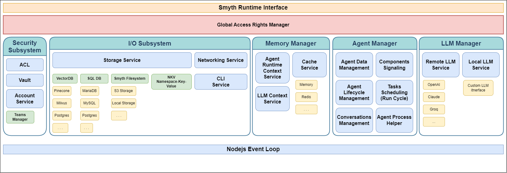

# Smyth Runtime Environment (SRE) Overview

## Core Architecture

SRE is designed following principles similar to operating system kernels, providing a robust and extensible environment for running AI Agents. Just as operating systems manage processes and resources through subsystems and drivers, SRE manages AI Agents through subsystems and connectors.

### Key Architectural Concepts

1. **Subsystem Connectors**

    - Similar to OS kernel subsystems and drivers
    - Each service is provided through extensible connector interfaces
    - Connectors can be swapped/extended without affecting the core system
    - Examples include Storage, Logging, Memory Management, etc.

2. **Security Layer**
    - Low-level security through Candidate/ACL system
    - Every operation requires proper access rights
    - Granular control over resources and operations
    - Similar to OS user/permission systems

## Available Subsystems

### 1. IO (Input/Output) Subsystem

-   **CLI Service**: Command-line interface handling
-   **Log Service**: Logging with Console and Smyth implementations
-   **NKV Service**: Namespace-Key-Value storage (Redis implementation)
-   **Router Service**: HTTP routing functionality (Express implementation)
-   **Storage Service**: File and data persistence operations

### 2. Security Subsystem

-   Access control and authentication management
-   Candidate/ACL system implementation
-   Permission and resource access control
-   Identity and credential management

### 3. Core Subsystem

-   Service management and registration
-   Runtime environment control
-   Connector base implementations
-   System configuration management

### 4. Memory Manager Subsystem

-   Cache service implementation
-   Runtime context management
-   Resource allocation and tracking
-   State persistence and retrieval

### 5. Agent Manager Subsystem

-   Agent lifecycle management
-   Runtime execution control
-   Component system implementation
-   Agent data and settings management

## Agent Subsystem

The Agent subsystem is analogous to the process subsystem in operating systems. Just as an OS manages applications, SRE manages AI Agents.

### Agent Architecture

1. **Agent Process**

    - Represents a running instance of an AI Agent
    - Manages lifecycle and runtime context
    - Handles input/output and state management
    - Provides isolation between different agent instances

2. **Components**
    - Building blocks of Agents (similar to system calls and libraries in OS)
    - Provide specific functionalities (LLM calls, data processing, etc.)
    - Can be connected to form complex workflows
    - Managed by the Agent Runtime

### Component System

Components are the fundamental building blocks of Agents, providing modular functionality:

1. **Core Components**

    - LLM Integration
    - Data Processing
    - I/O Operations
    - Memory Management

2. **Component Workflow**
    - Components can be connected to form processing pipelines
    - Data flows between components through defined interfaces
    - Supports both synchronous and asynchronous operations
    - Enables complex AI workflows

## Subsystems Overview

1. **IO Subsystem**

    - Storage Service: File and data persistence
    - Log Service: Activity and debug logging
    - Router Service: External communication (when needed)
    - CLI Service: Command-line interface

2. **Memory Management**

    - Cache Service: Temporary data storage
    - Runtime Context: Agent state management
    - Resource monitoring and management

3. **Security Subsystem**

    - Access Control: Candidate/ACL system
    - Vault Service: Secure credential storage
    - Account Service: Identity management

4. **LLM Management**
    - Model integration
    - Prompt management
    - Response processing
    - Token usage tracking

## Boot Process

The system initialization follows a structured boot sequence:

1. Core services initialization
2. Subsystem registration
3. Connector setup
4. Agent runtime preparation

This architecture ensures:

-   Modularity and extensibility
-   Robust security
-   Resource isolation
-   Scalable AI agent execution
